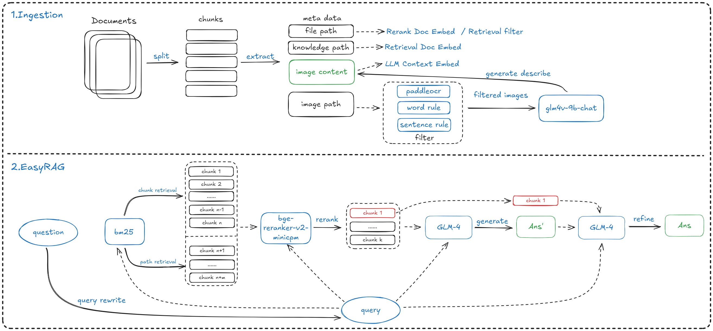

# EasyRAG: Efficient Retrieval-Augmented Generation Framework for Automated Network Operations

[](https://github.com/BUAADreamer/EasyRAG/blob/main/licence)
[](https://arxiv.org/abs/2410.10315)
[](https://github.com/BUAADreamer/EasyRAG/stargazers)
[](https://zhuanlan.zhihu.com/p/7272025344)
## Table of Contents

- [Overview](#Overview)
- [Requirements](#Requirements)
- [Reproduce](#Reproduce)
- [Usage](#Usage)
- [Project Structure](#Project-Structure)
- [Citation](#Citation)
- [Acknowledgement](#Acknowledgement)

## Overview

This paper presents EasyRAG, a simple, lightweight, and efficient retrieval-augmented generation framework for automated network operations. Our framework has three advantages. The first is accurate question answering. We designed a straightforward RAG scheme based on (1) a specific data processing workflow (2) dual-route sparse retrieval for coarse ranking (3) LLM Reranker for reranking (4) LLM answer generation and optimization. This approach achieved first place in the GLM4 track in the preliminary round and second place in the GLM4 track in the semifinals. The second is simple deployment. Our method primarily consists of BM25 retrieval and BGE-reranker reranking, requiring no fine-tuning of any models, occupying minimal VRAM, easy to deploy, and highly scalable; we provide a flexible code library with various search and generation strategies, facilitating custom process implementation. The last one is efficient inference. We designed an efficient inference acceleration scheme for the entire coarse ranking, reranking, and generation process that significantly reduces the inference latency of RAG while maintaining a good level of accuracy; each acceleration scheme can be plug-and-play into any component of the RAG process, consistently enhancing the efficiency of the RAG system.

<div align="center">
    
</div>

## Requirements

EasyRAG needs Python3.10.14 and at least 1 GPU with 16GB. 

You need to change `llm_keys` in `src/easyrag.yaml` to your GLM keys.

```shell
pip install -r requirements.txt
git lfs install
bash scripts/download.sh # download models
bash scripts/process.sh # process zedx data

```

## Reproduce

### 1. Run Directly

```bash
cd src
# run challenge questions
python3 main.py 
# copy answer file
cp submit_result.jsonl ../answer.jsonl
```

### 2. Run with Docker

```bash
chmod +x scripts/run.sh
./scripts/run.sh
```

## Usage

### 1. API

```bash
cd src
uvicorn api:app --host 0.0.0.0 --port 8000 --workers 1
```

### 2.WebUI

You need to run the API first

```bash
cd src
streamlit run webui.py
```

## Project Structure

Only the code that may be used in the semi-final is explained.

```yaml
- src
    - custom
        - splitter.py # Custom Chunk Splitter
        - hierarchical.py # hierarchical Chunk Splitter
        - transformation.py # File path and title extraction
        - embeddings # Implement a separate embedding class for the GTE
            - ...
        - retrievers.py # Implementation of a qdrant-based dense retriever, Chinese BM25 retriever, implementation of a fusion retriever with rrf and simple merge
        - rerankers.py # Implement some classes separately for the bge series of rerankers for easy custom use
        - template.py # QA Prompt Template
    - pipeline
        - ingestion.py # Data processing flow: data reader, metadata extraction, document chunking, document encoding, metadata filters, vector database creation
        - pipeline.py # EasyRAG Pipeline class, containing initialisation of various data and models, custom RAG Pipeline definitions
        - rag.py # Some tool functions for rag
        - qa.py # Read the question file and save the answer
    - utils # The hf-adapted custom llm for the usage in China and is copied directly from the code in the hf link of the corresponding model.
        - ...
    - configs
        - easyrag.yaml # configuration file
    - data
        - nltk_data # stop word lists and tokenizer data in nltk
        - hit_stopwords.txt # HIT Chinese Stop Word List
        - imgmap_filtered.json # Processed by get_ocr_data.py
        - question.jsonl # Semi-Final Test Set
    - main.py # Main Functions, Entry Files
    - api.py # FastAPI Service
    - preprocess_zedx.py # zedx data preprocessing
    - get_ocr_data.py # paddleocr+glm4v extracts image content
    - submit.py # Submit Results to Challenge
- requirements.txt # python requirements
- run.sh # docker run script
- Dockerfile # docker configuration file
```

## Citation

```latex
@article{feng2024easyrag,
  title={EasyRAG: Efficient Retrieval-Augmented Generation Framework for Automated Network Operations},
  author={Feng, Zhangchi, Kuang Dongdong, Wang Zhongyuan, Nie Zhijie, Zheng Yaowei and Zhang, Richong},
  journal={arXiv preprint arXiv:2410.10315},
  year={2024}
}
```

## Acknowledgement

Thanks to the [CCF AIOps 2024 Challenge Organising Committee](https://competition.aiops-challenge.com/home/competition/1780211530478944282) , they provide high quality data and a good atmosphere.

## Star History

